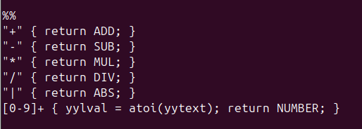
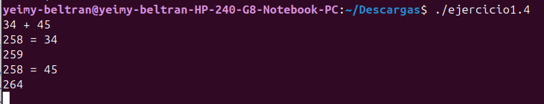
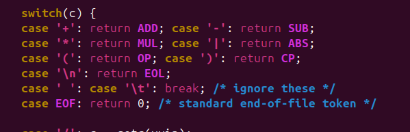
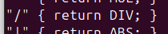

# Ejercicio 4— Scanner escrito a mano vs. Flex

¿La versión escrita a mano del scanner del Ejemplo 1-4 reconoce exactamente los mismos tokens que la versión de Flex?


**R//** No. La versión escrita a mano no reconoce exactamente los mismos tokens ni tiene exactamente el mismo comportamiento que la versión de Flex.

## ¿Por qué?

Para comprobarlo, se pueden comparar directamente las reglas de los dos scanners.

### 1. Tokens que reconoce la versión de Flex

En el Ejemplo 1-4 aparecen estas reglas:


| Entrada | Token |
|---|---|
| `+` | `ADD` |
| `-` | `SUB` |
| `*` | `MUL` |
| `/` | `DIV` |
| `|` | `ABS` |
| `34`, `45`, etc. | `NUMBER` |
| Enter | `EOL` |

Por ejemplo, si se introduce:



```text
34 + 45
```

el scanner identifica:

```text
34  → NUMBER
+   → ADD
45  → NUMBER
```

### 2. Tokens de la versión escrita a mano

En la versión handwritten aparecen también:



```c
case '(': return OP;
case ')': return CP;
```

Por lo tanto:

```text
( → OP
) → CP
```

Estos tokens **no aparecen en las reglas del scanner de Flex del Ejemplo 1-4**.

### 3. Diferencia con `/`

También hay una diferencia en el tratamiento de `/`.

En Flex:



```text
"/" → DIV
```

Es decir, cuando encuentra `/`, devuelve directamente el token `DIV`.

En la versión escrita a mano, primero comprueba si después de `/` aparece otro `/`:


```text
/ / → comentario
```

Por eso `//` se trata como un comentario. Si solamente aparece `/`, entonces devuelve `DIV`.

## Demostración

Podemos comparar algunos ejemplos:

| Entrada | Flex (Ejemplo 1-4) | Handwritten |
|---|---|---|
| `+` | `ADD` | `ADD` |
| `34` | `NUMBER` | `NUMBER` |
| `*` | `MUL` | `MUL` |
| `/` | `DIV` | `DIV` |
| `(` | No tiene regla | `OP` |
| `)` | No tiene regla | `CP` |
| `// comentario` | `/` se reconoce como `DIV` y el segundo `/` también se procesa | Se reconoce como comentario |

Esto demuestra que **no son exactamente iguales**.

## Conclusión

La respuesta es **No**.

Aunque los dos scanners reconocen varios tokens iguales, la versión escrita a mano reconoce `(` y `)` como tokens `OP` y `CP`, y además tiene un tratamiento especial para `//` como comentario. Por estas diferencias, **no reconocen exactamente los mismos tokens ni se comportan de la misma manera**.
